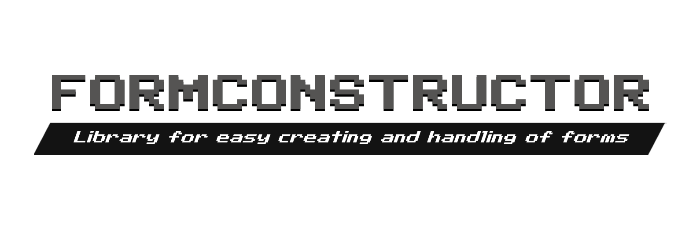

[](LICENSE)
[](https://github.com/ContentForge/FormConstructor/releases/tag/1.0.2)
[](https://cloudburstmc.org/resources/formconstructor.738/)

Introduction
------------- 

Library is designed to simplify the creation and handling of forms.
It has a few key advantages over other  form libraries:

- Forms are processed using a lambda, which is passed when the form itself is created, and not by catching events.
- For each button we can set a lambda function in SimpleForm.
- In SimpleForm we get a button object as a response, where we can get its text and index.
- In CustomForm we can mark elements with an identifier to conveniently get this element in its handler. We can get element by id and its index.

Examples
-------------

For SimpleForm:
```java
SimpleForm form = new SimpleForm("Sample title");

SimpleFormHandler handler = (p, button) -> {
    p.sendMessage("Your selected button is " + button.getName());
    p.sendMessage("Its index - " + button.index);
};

form.setContent("This is a text")
    .addContent("\nThis is addition :3")
    .addButton("Test button", handler)
    .addButton("Same button but with image", ImageType.PATH, "textures/items.diamond", handler)
    .addButton("Button without handler");

//We can set handler for null result
form.setNoneHandler(p -> {
    p.sendMessage("Why you closed this form? :c");
});

form.send(player);
//Also we can use `player.showFormWindow(form);` but it isn't comfortable
```

For ModalForm:

```java
ModalForm form = new ModalForm("Test modal form");

form.setContent("Is OneKN gay?") //local meme in RuNukkitDev
    .setPositiveButton("Yes")
    .setNegativeButton("Sure");

form.setResponse((p, result) -> {
    p.sendMessage(result? "I knew it!" : "Quite right :D");
});

form.send(player);
```

For CustomForm:

```java
CustomForm form = new CustomForm("Sample custom form");

List<SelectableElement> elements = Arrays.asList(
    new SelectableElement("Option 1"),
    new SelectableElement("Option 2 but with value", 42),
    new SelectableElement("Option 3")
);

form.addElement(new Label("This is a test"))
    .addElement("Easy way to add a label")
    .addElement("my-text",
            new Input("Input", "This is a placeholder", "Default value")
    ).addElement("my-toggle", new Toggle("Toggle?", true))
    .addElement("my-dd", new Dropdown("Dropdown",  elements))
    .addElement(new Dropdown("Dropdown with default value", elements, 1))
    .addElement("my-ss", new StepSlider("Step slider", elements, 2));

form.setHandler((p, response) -> {
    //We can get by id and index
    p.sendMessage(response.getInput("my-text").getValue());
    p.sendMessage(response.getInput(1).getValue()); //It's bad method
    p.sendMessage(response.getToggle("my-toggle").getValue());
    
    SelectableElement el = response.getDropdown("my-dd").getValue();
    p.sendMessage(el.getText());
    if(el.getValue() != null) p.sendMessage(el.getValue(Integer.class));
    
    el = response.getStepSlider("my-ss").getValue();
    p.sendMessage(el.getText());
});
```


Donate
-------------

- [DonationAlerts](https://www.donationalerts.com/r/qpexlegendary)
